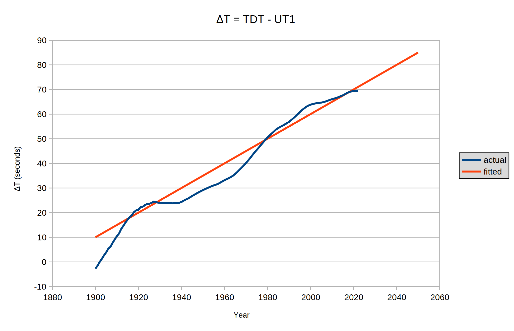

# Lunar Phases

## tl;dr - the algorithm

An algorithm for calculating the phase of the moon between 1900 and 2149 is presented below.

This algorithm actually calculates the fraction of the moon's disk that is illuminated by the sun as seen from the earth. This is equal to the fraction of the moon's diameter illuminated by the sun along every chord perpendicular to the axis of the phase.

```c
#include <math.h>

/**
 * @arg sec the number of seconds since 1970 Jan 1 00:00:00 UTC
 * @return the illuminated fraction of the moon's disk as seen from earth
 *
 * @author github.com/deirdreobyrne
 */
double getPhase(double sec) {

  double l = fmod(4.455916788395823 + sec/378902.2550719889, 2.0*M_PI);
  double f = fmod(3.711912015016090 + sec/374194.9107230363, 2.0*M_PI);
  double m = fmod(6.244925278898623 + sec/5022680.344082363, 2.0*M_PI);
  double d = fmod(4.847287446660956 -
             (sec/1.0595e18 - sec)/406074.7508723456, 2.0*M_PI);

  return (1.0 - cos ( d
          +1.095592850837296e-01 * sin(l)
          -3.649736985992089e-02 * sin(m)
          +2.202605149250539e-02 * sin(2.0*d-l)
          +1.408267088017852e-02 * sin(2.0*d)
          +3.735791629462980e-03 * sin(2.0*l)
          +1.951014794328968e-03 * sin(d)
          -1.836366081017675e-03 * sin(2.0*f)
          +1.295101137710685e-03 * sin(4.0*d)
          +1.008575724100870e-03 * sin(2.0*(d-l))
          +9.940741485840730e-04 * sin(2.0*d-m-l)
          +9.515708542153308e-04 * sin(2.0*d+l)
          -9.031978159721983e-04 * sin(2.0*(d+f))
          +8.091606805138698e-04 * sin(2.0*(f-d))
          +7.949457895819001e-04 * sin(2.0*d-m)
          -7.165256461239489e-04 * sin(m-l)
          -5.333556551468582e-04 * sin(m+l)
          -3.823095408020891e-04 * sin(2.0*m)
          -2.600546963158116e-04 * sin(d-l)
        ))/2.0;
}
```

The argument is the number of seconds since 1970 Jan 1 00:00:00 UTC. The return result is the fraction of the moon's disk illuminated by the sun as seen from the earth. The accuracy is to within 0.002 during the entire period 1900-2149.

Note that the result will not be *exactly* 0.0 at new moon, 1.0 at full moon, or 0.5 at the quarters. This is (mostly) because the definition of those 4 "phases of the moon" doesn't, as such, depend on the illuminated fraction of the moon's disk.

Note also that the only way of determining if the moon is waxing or waning is to take the derivative of the function in `getPhase(double)`. Alternatively a second call to `getPhase(double)`could be made with an argument a few seconds into the future to see if the result is increasing or decreasing.

Finally, the output of `getPhase(double)`will (almost certainly) *never* be 1.0 or 0.0. This is because, at new and full moon, the moon is north or south enough that a tiny amount of it remains illuminated. Indeed if the output of `getPhase(double)`is close to 1.0, it could mean that the moon is actually eclipsed by the earth!

## Accuracy, or speed and small footprint?

If you cut off some of the terms in the equation in `getPhase(double)`you can increase the speed and reduce the footprint of the algorithm in a trade-off with accuracy. This could be useful, for instance, in a smartwatch which has only a small screen anyway in which to display the moon's phase, and which has limited resources which need to be managed.

This table gives the maximum error in the period 1900 - 2149 when some terms are omitted.

| **Omit from**      | **Accuracy** |
| ------------------:|:------------:|
| ... sin(l)         | 0.086059     |
| ... sin(m)         | 0.036332     |
| ... sin(2.0*d-l)   | 0.019999     |
| ... sin(2.0*d)     | 0.010258     |
| ... sin(2.0*l)     | 0.005273     |
| ... sin(d)         | 0.003702     |
| ... sin(2.0*f)     | 0.002846     |
| ... sin(4.0*d)     | 0.002603     |
| ... sin(2.0*(d-l)) | 0.002304     |
| ... sin(2.0*d-m-l) | 0.002256     |
| ... sin(2.0*d+l)   | 0.002143     |
| ... sin(2.0*(d+f)) | 0.002083     |
| ... sin(2.0*(f-d)) | 0.002071     |
| ... sin(2.0*d-m)   | 0.002057     |
| ... sin(m-l)       | 0.002001     |
| ... sin(m+l)       | 0.001958     |
| ... sin(2.0*m)     | 0.001954     |
| ... sin(d-l)       | 0.001943     |
| *nothing*          | 0.001937     |

So if an accuracy of 9% is sufficient, the equation can be reduced to `(1.0 - cos(d))/2.0`, and hence there is no need to calculate *f, l* or *m*.

## Derivation

Please note that I only have enough knowledge of mathematics and astronomy to be dangerous. So, I wish to present the method I used to arrive at the algorithm, as I'm quite sure it's not The Right Way To Do Things<sup>tm</sup>.

My first task was to collect a large dataset against which I could run a fitting function. My source for this dataset was the excellent [Solex](http://www.solexorb.it/) program. Using the settings in the diagram below, I gathered solar and lunar right ascension, declination, and distance data for 524,288 (2<sup>19</sup>) periods of 3 hours each starting at 1970 Jan 1 00:00:00 TDT.


I ended up with two CSV files - one each for the sun and moon - containing Julian date, right ascension, declination, and distance data.

The next step was to import that data into [GNU Octave](https://octave.org/index.html) and convert it into a lunar phase dataset.

```matlab
format long;

printf("\nLoading data for phase angle calculation\n");
sun=csvread("SUN.csv");
moon=csvread("MOON.csv");

ang=[zeros(524288,2)];

printf("Starting...\n");

for i = 1 : 524288
  sd=deg2rad(sun(i,3));
  sr=deg2rad(sun(i,2));
  md=deg2rad(moon(i,3));
  mr=deg2rad(moon(i,2));
  psi=acos(sin(sd)*sin(md)+cos(sd)*cos(md)*cos(sr-mr));
  rs=sun(i,4)*149.59787066;
  rm=moon(i,4);
  ang(i,1)=sun(i,1)-2451545;
  ang(i,2)=psi + atan2(rm*sin(psi), rs-rm*cos(psi));
  if (mod(i,5000) == 0)
    printf("(%d / 524288)\n",i);
  endif;
end;

printf("\nDONE!\n");

csvwrite("i.csv",ang);
```

This actually creates a CSV file containing the number of days since 2000 Jan 1.5 (a standard epoch in astronomy), with a value related to the selenocentric elongation of the Earth. I had intended to calculate the latter using the following formulae (taken from Jean Meeus' excellent 1991 book *Astronomical Algorithms*)

$$
\psi = cos^{-1} ( sin (\delta_s) sin (\delta_m) + cos (\delta_s) cos (\delta_m) cos (\alpha_s - \alpha_m)) )
$$

$$
i = tan^{-1} \left( {{R_s sin (\psi)} \over {R_m - R_s cos (\psi)}} \right)
$$

where *α<sub>s</sub>, δ<sub>s</sub>* and *R<sub>s</sub>* are the sun's right ascension, declination and distance; *α<sub>m</sub>, δ<sub>m</sub>* and *R<sub>m</sub>* are the moon's right ascension, declination and distance; *ψ* is the geocentric elongation of the moon from the sun, and *i* is the selenocentric elongation of the earth from the sun. However, due to a futile attempt to make *i* continually increasing with time, I ended up using a modified version of the second formula above —

$$
i = \psi + tan^{-1} \left( {R_m sin (\psi)} \over {R_s - R_m cos(\psi)} \right)
$$

This gives an angle *i* which is the *complement* of the selenographic elongation of the earth from the sun. It is also, technically, a worse way of doing the calculation due to the difficulties in calculating the inverse cosine of values close to ±1 which lead to potential errors in *ψ*. However I believe my mistake made no substantive difference.

When *i* is the complement of the selenocentric elongation of the earth, then the phase is simply

$$
k = \left( {1 - cos(i)} \over 2 \right)
$$

## Now the fun starts - fitting!

to be written

## Δt — the boogeyman of astronomical predictions

Solex works in TDT, whereas our clocks work in UTC, and the difference between the two (imaginatively called Δt) is not constant and not predictable (due to minor irregularities in the rotation of the earth caused by, amongst many other things, earthquakes). I adopted a very simple and reasonably accurate formula (for historical times, anyway) for Δt —

$$
\Delta t (seconds) = 45 + 50 { d \over 36525}
$$

where *d* is the number of days elapsed since 1970 Jan 1 00:00:00 UTC.



## Refining the result

to be written
